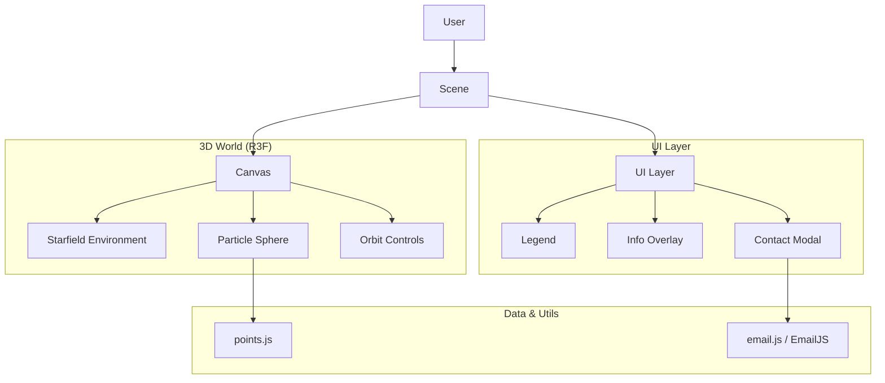

# Architecture

> Auto-generated by /map on 2026-02-16

## Overview

GSAP-Sphere is a 3D interactive visualization application built with React and Three.js. It features a rotating sphere composed of particles, where specific points can be clicked to reveal information or a contact form. The application uses GSAP for animations and EmailJS for handling contact form submissions.

## Components

### Core (`src/components/`)
- **Scene.jsx**: Main entry point for the 3D scene. Manages global state (active point), camera, lighting, and layout.
  - **Location:** `src/components/Scene.jsx`
  - **Dependencies:** `ParticleSphere`, `Starfield`, `Legend`, `Overlay`, `ContactModal`

### 3D Elements (`src/components/Sphere/`, `src/components/Environment/`)
- **ParticleSphere**: The central interactive sphere. Handles particle rendering and click events.
- **Stars**: Renders the background starfield.

### UI (`src/components/UI/`)
- **Legend**: Displays the legend/key for the visualization.
- **Overlay**: Shows detailed information when a point on the sphere is clicked.
- **ContactModal**: A modal form for user contact, triggered by specific sphere points.

## Data Flow

1. **User Interaction**: User interaction (click) on the `ParticleSphere` triggers an event.
2. **State Update**: `Scene.jsx` receives the event and updates the `activePoint` state.
3. **UI Rendering**: 
   - `Overlay` or `ContactModal` renders based on the `activePoint` ID.
   - `OrbitControls` auto-rotation pauses while interacting.
4. **External Action**: Submitting the form in `ContactModal` calls `sendContactForm` in `email.js` to send an email via EmailJS.

## Integration Points

| Service | Type | Purpose |
|---------|------|---------|
| EmailJS | API | Sending emails from the contact form (`src/utils/email.js`) |

## Technical Debt

- [ ] **Hardcoded EmailJS Credentials**: `src/utils/email.js` contains hardcoded service/template IDs and public key. These should be moved to environment variables.
- [ ] **Prop Drilling**: Simple state management, currently manageable but could scale poorly.

## Conventions

**Naming:** PascalCase for components, camelCase for functions/vars.
**Structure:** Component-based folder structure (atomic design-ish).
**Testing:** No testing framework set up or tests found.
