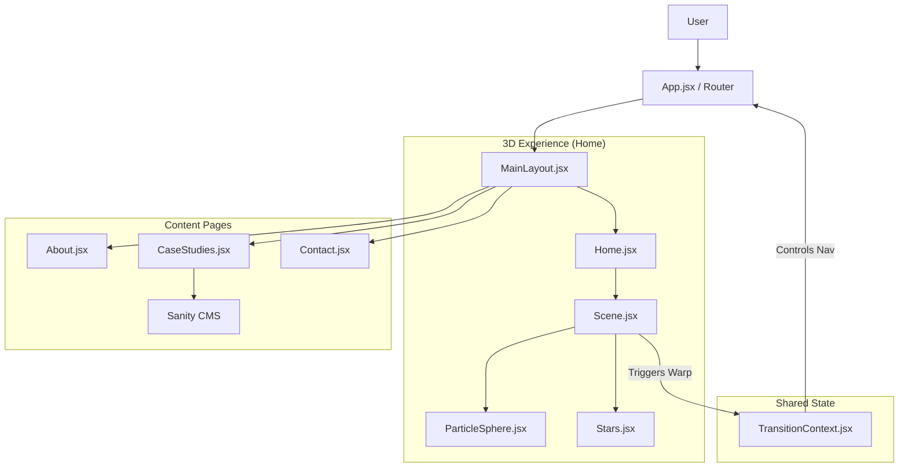

# Architecture

> Auto-generated by /map on 2026-02-16

## Overview

The application is a **3D Immersive Portfolio** built with React, Three.js (R3F), and GSAP. It features a "Sci-Fi / Cyber" aesthetic with a central navigation sphere that transitions into standard 2D content pages using a "Warp" effect. Content is managed via Sanity Headless CMS.

## Components

### Core
- **App.jsx**: Application entry point. Configures `BrowserRouter`, `TransitionProvider`, and Routes.
- **MainLayout.jsx**: Global layout wrapper. Handles `Navbar`, `GlitchOverlay`, and "Return to Map" navigation.
- **TransitionContext.jsx**: Manages global transition states (`isWarping`, `isGlitching`) and provides `navigateWithWarp` utility.

### 3D Scene
- **Scene.jsx**: Main R3F Canvas. Orchestrates the 3D environment.
- **ParticleSphere.jsx**: Interactive navigation menu. Points on the sphere trigger routing.
- **Stars.jsx**: Background starfield. Reacts to warp state (speed increase).
- **ContactModal.jsx**: (Legacy/Hybrid) 3D overlay for contact form (uses EmailJS).

### CMS Integration
- **sanityClient.js**: Configures Sanity Client (`@sanity/client`) and Image Builder.
- **ProjectList.jsx**: Fetches and displays projects from Sanity. Uses inline styling and simple master-detail view.

## Data Flow

### Navigation
1.  User clicks a point on `ParticleSphere`.
2.  `Scene` calls `navigateWithWarp('/path')` from `TransitionContext`.
3.  `isWarping` state becomes `true`.
4.  `Stars` accelerate; `ParticleSphere` distorts.
5.  After timeout (1.5s), Router navigates to target page.
6.  `isWarping` becomes `false`.

### Content
1.  `CaseStudies` page renders `ProjectList`.
2.  `ProjectList` fetches data from Sanity API (`*[_type == "project"]`).
3.  Data is stored in local state and rendered.

## Integration Points

| Service | Type | Purpose |
|---------|------|---------|
| **Sanity.io** | Headless CMS | Stores project data (title, desc, images, tech stack). |
| **EmailJS** | Email API | Sends contact form submissions from `ContactModal`. |

## Technical Debt

- [ ] **Inline Styles**: `ProjectList.jsx` and `MainLayout.jsx` use heavy inline styles instead of CSS Modules or Tailwind.
- [ ] **Hardcoded Config**: Sanity Project ID and EmailJS keys are hardcoded in source files (`sanityClient.js`, `email.js`).
- [ ] **Mixed Routing**: Some navigation is 3D-based (Sphere), some is 2D (Navbar). Needs consistent history management.
- [ ] **Accessibility**: 3D Canvas lacks keyboard navigation support.

## Conventions

- **State**: Context API for global transitions; Local state for UI/Forms.
- **Styling**: Mixed (CSS Modules, Global CSS, Inline Styles).
- **Animations**: GSAP for UI transitions; R3F `useFrame` for 3D animations.
