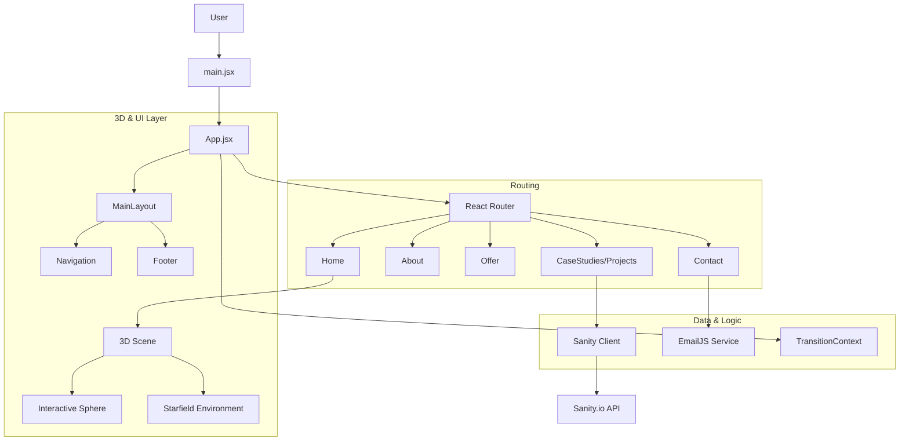

# Architecture

> Auto-generated by /map on 2026-02-18

## Overview

**GSAP-Sphere** is an immersive 3D portfolio application built with React and Vite. It features a rich 3D environment powered by React Three Fiber (R3F) and GSAP for animations. The application showcases projects, an about section, and an offer page, all integrated with a CMS for dynamic content.

## Components

### Core Pages (`src/pages/`)
- **Home.jsx**: Landing page with the main 3D sphere experience.
- **About.jsx**: Biographical information.
- **Offer.jsx**: Services offered.
- **CaseStudies.jsx / ProjectDetails.jsx**: Portfolio projects list and details views.
- **Contact.jsx**: Contact page (potentially modal-based in usage).

### 3D Components (`src/components/`)
- **Sphere/**: Contains the core interactive sphere logic.
- **Environment/**: Background elements like `Stars.jsx`.
- **Scene.jsx**: Main canvas orchestration.

### CMS Integration (`src/CMS/`, `src/sanityClient.js`)
- **sanityClient.js**: Configured Sanity client for fetching content.
- **CMS/**: Likely contains GROQ queries or schemas (needs verification of contents).

### UI/Layout (`src/components/UI/`, `src/layouts/`)
- **MainLayout.jsx**: Persistent layout wrapper (Nav + Footer).
- **ContactForm.jsx**: Holographic styled contact form with validation.
- **SEO.jsx**: Head management using `react-helmet-async`.

## Data Flow

1.  **Content fetching**: Pages (like CaseStudies) fetch data from Sanity.io using `sanityClient.js`.
2.  **User Input**: Contact form data is captured in `ContactForm.jsx` and sent via `utils/email` (EmailJS).
3.  **State Management**: `TransitionContext` manages page transition states to coordinate GSAP animations with route changes.

## Integration Points

| Service | Type | Purpose |
|---------|------|---------|
| **Sanity.io** | Headless CMS | Managing portfolio projects and text content. |
| **EmailJS** | API | Handling contact form submissions without a backend. |

## Technical Debt / Observations

- [ ] **Naming Consistency**: `ContactForm.jsx` imports `ContactModal.module.css` (potential mismatch or reuse).
- [ ] **Hardcoded Config**: Sanity Project ID is hardcoded in `sanityClient.js` (standard for public ids, but env vars preferred).
- [ ] **Styling Mix**: Mix of global `App.css`, `index.css` and CSS Modules (`Contact.module.css`).

## Conventions

- **Naming**: PascalCase for components, camelCase for utilities.
- **Structure**: Feature-based grouping inside `components` (Sphere, UI, Environment).
- **Routing**: `react-router-dom` v6+ structure.
